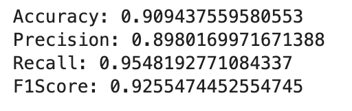
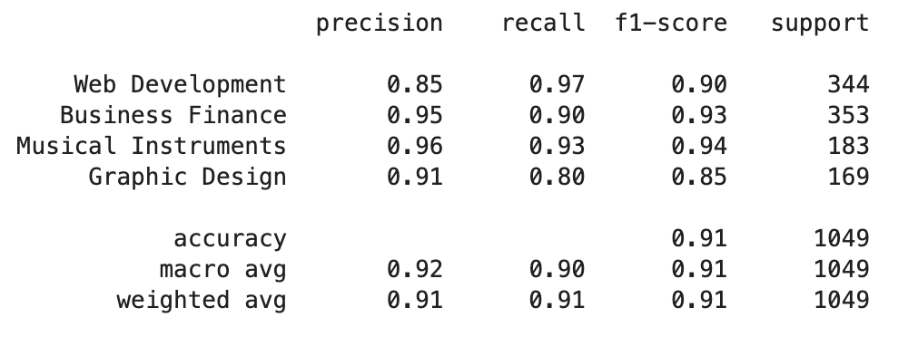
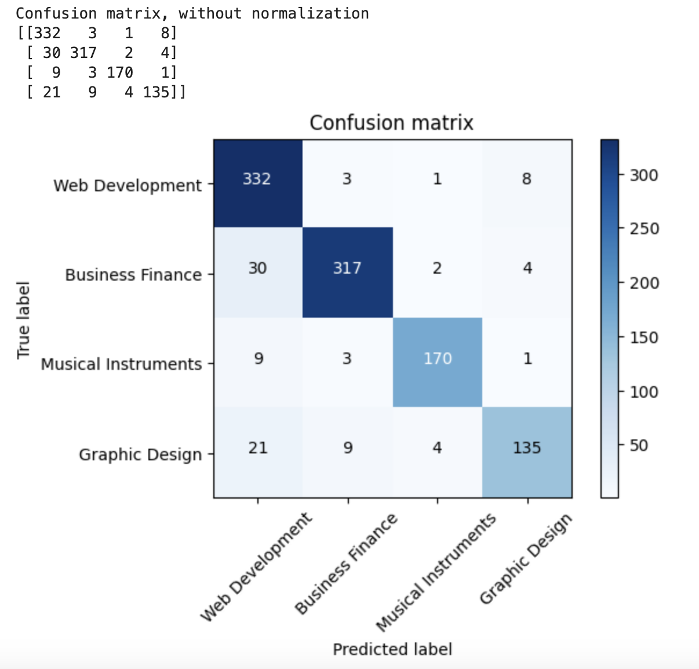

# Text Classification using PySpark and Databricks


Credits:[Medium](https://medium.com/@bedigunjit/simple-guide-to-text-classification-nlp-using-svm-and-naive-bayes-with-python-421db3a72d34)

<a href="https://www.python.org/">  </a> <a href="https://spark.apache.org/">  </a> <a href="https://pyspark.apache.org/">  </a> <a href="https://www.java.com/">  </a> <a href="https://www.databricks.com/">  </a> <a href="https://jupyter.org/">  </a> <a href="https://www.nltk.org/">  </a> <a href="https://scikit-learn.org/stable/">  </a>

## Introduction

In the age of digital education, online course platforms like Udemy host a vast array of courses across various subjects. With thousands of courses available, effective categorization becomes crucial for enhancing user experience and ensuring that learners can easily find relevant content. This project aims to classify course titles into predefined categories using machine learning techniques while also utilizing PySpark and Databricks.

## Uses of Text Classification

Below are some key business applications of Text Classification:

**Customer Support Automation**:
  - Automatically classifying customer queries to route them to the appropriate support channels, enhancing response times and reducing costs.

**Sentiment Analysis**: 
   - Analyzing customer feedback, reviews, and social media content to gauge public sentiment towards products or services, guiding business decisions.

**Spam Detection**: 
   - Filtering spam and phishing messages from communication platforms, improving user experience and security.

**Content Moderation**: 
   - Automatically categorizing and moderating user-generated content to maintain community standards and protect brand reputation.

**Document Classification**: 
   - Organizing and classifying documents (e.g., legal, research) for easier retrieval and management.

**Personalized Recommendations**: 
   - Classifying user behavior and preferences to enhance recommendation systems, increasing engagement and conversion rates.

**Market Research Insights**: 
   - Analyzing and categorizing data from surveys and forums to identify customer trends and preferences.

**News Categorization**: 
   - Automatically classifying news articles into relevant topics for better user navigation and retention.

**Survey Analysis**: 
   - Classifying responses from open-ended survey questions to derive actionable insights from qualitative data.

### Requirements for this Project

- Apache Spark
- Java
- Python
- Jupyter Lab
- Databricks

Tips on getting started with PySpark on Mac and Windows
[Link](https://www.youtube.com/watch?v=WxWRXNna1Qw&t=183s)

### Why This Project?

The motivation behind this project is twofold:  

1) **Real-World Application**: This project illustrates the practical application of machine learning in natural language processing, which is a rapidly growing field. By automating text classification, we can provide valuable insights into user preferences and market trends.
2) **PySpark and Databricks**: Implementation of PySpark and Databricks as businesses utilize these tools for processing huge amounts of data and these tools help with handling and processing them.


Credits: [Databricks](https://www.databricks.com/resources/ebook/maximize-your-organizations-potential-data-and-ai?scid=7018Y000001Fi1AQAS&utm_medium=paid+search&utm_source=google&utm_campaign=15418435374&utm_adgroup=130717555576&utm_content=ebook&utm_offer=maximize-your-organizations-potential-data-and-ai&utm_ad=703594935116&utm_term=databricks&gad_source=1&gbraid=0AAAAABYBeAiB5OhCYYsbYMjQEahkFsQ_8&gclid=Cj0KCQjw3vO3BhCqARIsAEWblcCfMdexHt8VdfjOLie7FXJzew7AkQdmjeicLSW2CAUU3rqJmk80dzMaAq8kEALw_wcB) & [Apache Spark](https://spark.apache.org)
### Why PySpark and Databricks?

- **PySpark**: PySpark is a powerful tool for handling large-scale data processing. It allows for distributed computing, making it efficient to process large datasets quickly. Its integration with Apache Spark enables advanced analytics and machine learning capabilities, which are crucial for data science projects with huge workloads.

- **Databricks**: Databricks provides a collaborative environment that enhances productivity for data science teams. It simplifies the process of working with big data and integrates seamlessly with cloud services for scalability and easy model deployment. Its built-in support for notebooks allows for real-time collaboration, making it easier to iterate on models and share insights.

## Dataset


Credits: [Udemy](www.udemy.com)

The dataset used in this project consists of course information from Udemy, including the following columns:
[Kaggle Link](https://www.kaggle.com/datasets/andrewmvd/udemy-courses)

- **_c0**: Index  
- **course_id**: Unique identifier for each course  
- **course_title**: Title of the course  
- **url**: Link to the course  
- **is_paid**: Indicates whether the course is paid  
- **price**: Price of the course  
- **num_subscribers**: Number of subscribers  
- **num_reviews**: Number of reviews  
- **num_lectures**: Number of lectures in the course  
- **level**: Level of the course (beginner, intermediate, advanced)  
- **content_duration**: Duration of course content  
- **published_timestamp**: Date and time when the course was published  
- **subject**: Subject category of the course  
- **clean_course_title**: Preprocessed title of the course  

## Project Steps

### 1. Data Preprocessing

#### Data Inspection and Cleaning

- Ensuring data quality is crucial for model performance. Inspecting values and data types helps identify discrepancies and null values that can skew results.

- Loading a dataset using PySpark:
    ```python
    df = spark.read.csv("data/udemy_courses_clean.csv", header=True, inferSchema=True)
    df.show()
    ```
- Loading a dataset using pandas in a Jupyter Notebook:
    ```python
    import pandas as pd
    
    df = pd.read_csv("data/udemy_courses_clean.csv")
    print(df.head())
    ```
- Selecting specific columns in PySpark:
    ```python
    df = df.select('course_title', 'subject')
    df.show()
    ```
- Selecting specific columns using pandas:
    ```python
    df = df[['course_title', 'subject']]
    print(df.head())
    ```
- Counting occurrences of each subject in PySpark:
    ```python
    df.groupBy('subject').count().show()
    ```
- Counting occurrences of each subject using pandas:
    ```python
    subject_counts = df.groupby('subject').size().reset_index(name='count')
    print(subject_counts)
    ```

- Removing subjects with a count of 1 in PySpark:
    ```python
    df = df.where(df.subject.isin(df.groupBy('subject').count().filter('count > 1').select('subject').rdd.flatMap(lambda x: x).collect()))
    ```
- Removing subjects with a count of 1 using pandas:
    ```python
    counts = df['subject'].value_counts()
    df = df[df['subject'].isin(counts[counts > 1].index)]
    ```
- Checking for missing values in the `subject` column using PySpark:
    ```python
    missing_values_count = df.toPandas()['subject'].isnull().sum()
    print(f"Missing values in subject column: {missing_values_count}")
    ```
- Checking for missing values using pandas:
    ```python
    missing_values_count = df['subject'].isnull().sum()
    print(f"Missing values in subject column: {missing_values_count}")
    ```
### 2. Feature Engineering

#### Tokenization
- Tokenization breaks down text into individual words or tokens, which are essential for analysis. It converts the course titles into a format suitable for further processing.

#### Stop Words Removal
- Stop words (common words like "the," "and," "is") do not carry significant meaning for classification tasks. Removing them helps reduce noise in the data, allowing the model to focus on more informative words.

#### Count Vectorization
- Count vectorization transforms the text data into a numerical format (a document-term matrix) where each entry represents the frequency of a word in a document. This step is essential for machine learning algorithms that work with numerical data.

#### TF-IDF Transformation
- TF-IDF (Term Frequency-Inverse Document Frequency) assigns weights to the words based on their frequency and importance across documents. This helps highlight more relevant terms while diminishing the impact of common ones.


- Using PySpark feature engineering is as follows:
```
# Loading Transformer and Extractor Packages in PySpark
from pyspark.ml.feature import Tokenizer, StopWordsRemover, CountVectorizer, IDF

# Pipeline Stages in PySpark
tokenizer = Tokenizer(inputCol='course_title', outputCol='mytokens')
stopwords_remover = StopWordsRemover(inputCol='mytokens', outputCol='filtered_tokens')
vectorizer = CountVectorizer(inputCol='filtered_tokens', outputCol='rawFeatures')
idf = IDF(inputCol='rawFeatures', outputCol='vectorizedFeatures')
```
- In scikit-learn, the same feature engineering steps can be accomplished using TfidfVectorizer, which combines tokenization, stop word removal, and TF-IDF in one step.
```
from sklearn.feature_extraction.text import TfidfVectorizer

vectorizer = TfidfVectorizer(stop_words='english')
X = vectorizer.fit_transform(df['course_title'])
```

### 3. Label Encoding
- Label encoding converts categorical labels (course subjects) into a numerical format that machine learning algorithms can process.

- Label encoding in PySpark is done using the StringIndexer.

```
from pyspark.ml.feature import StringIndexer

labelEncoder = StringIndexer(inputCol='subject', outputCol='label').fit(df)
df = labelEncoder.transform(df)
```

- In scikit-learn, label encoding can be achieved using LabelEncoder.

```
from sklearn.preprocessing import LabelEncoder

labelEncoder = LabelEncoder()
y = labelEncoder.fit_transform(df['subject'])
```

### 4. Data Splitting
- Splitting the dataset into training and testing subsets helps evaluate model performance on unseen data, ensuring that the model generalizes well.

- Data splitting in PySpark can be done using randomSplit.

```
(trainDF, testDF) = df.randomSplit((0.7, 0.3), seed=42)
```

- In scikit-learn, data splitting is performed using train_test_split.
```
from sklearn.model_selection import train_test_split

X_train, X_test, y_train, y_test = train_test_split(X, y, test_size=0.3, random_state=42)
```

### 5. Model Training with Logistic Regression
- Logistic Regression is usually used for classification tasks. For multi-class classification, it can also extend to handle multiple classes through techniques like one-vs-rest, where a separate binary classifier is trained for each class. Thus, for our project we will just utilize this model for now.

- Model training in PySpark involves creating a LogisticRegression model and using a Pipeline for streamlined processing.

```
from pyspark.ml.classification import LogisticRegression
from pyspark.ml import Pipeline

lr = LogisticRegression(featuresCol='vectorizedFeatures', labelCol='label')
pipeline = Pipeline(stages=[tokenizer, stopwords_remover, vectorizer, idf, lr])

lr_model = pipeline.fit(trainDF)
predictions = lr_model.transform(testDF)
predictions.select('rawPrediction', 'probability', 'subject', 'label', 'prediction').show(10)
```

- In scikit-learn, the model training process is straightforward, fitting the model directly to the training data.
```
from sklearn.linear_model import LogisticRegression

model = LogisticRegression()
model.fit(X_train, y_train)

predictions = model.predict(X_test)
This structure highlights the differences in approach between PySpark and scikit-learn for each step of the text multi-classification process. Let me know if you need any further adjustments!
```
### 6. Model Evaluation

- Evaluating the model's performance using metrics like accuracy, precision, recall, and F1 score helps gauge its effectiveness in classifying the course titles.

- valuating model accuracy using PySpark:
    ```python
    from pyspark.ml.evaluation import MulticlassClassificationEvaluator
    
    evaluator = MulticlassClassificationEvaluator(labelCol='label', predictionCol='prediction', metricName='accuracy')
    accuracy = evaluator.evaluate(predictions)
    print(f"Accuracy: {accuracy}")
    
    from pyspark.mllib.evaluation import MulticlassMetrics
    
    lr_metric = MulticlassMetrics(predictions.select('label', 'prediction').rdd)
    print("Accuracy:", lr_metric.accuracy)
    print("Precision:", lr_metric.precision(1.0))
    print("Recall:", lr_metric.recall(1.0))
    print("F1Score:", lr_metric.fMeasure(1.0))
    ```
- Evaluating model performance using Scikit-learn(without PySpark):
    ```python
    from sklearn.metrics import confusion_matrix, classification_report

    print(classification_report(y_test, predictions))
    cm = confusion_matrix(y_test, predictions)
    print("Confusion Matrix:\n", cm)
    ```




**Inference from Results**
- The high accuracy of over 90% indicates that the model is effectively classifying course titles into their respective categories. Precision and recall scores suggest that the model not only identifies relevant classes well but also minimizes false positives. The F1 score reinforces the model's balance between precision and recall, making it reliable for practical use.

**Inference from PySpark and JupyterNotebook/Scikit-learn structure**
- In summary, while both PySpark and Jupyter Notebook/Scikit-learn serve important roles in data science, they cater to different needs. PySpark excels in scalability and performance for large datasets, making it suitable for production-level applications, particularly when dealing with big data. In contrast, Jupyter Notebook provides an excellent environment for exploration and analysis with smaller datasets.

- Although PySpark and Jupyter Notebook can perform similar tasks, there are certain nuances in the code that users must adhere to when switching between the two. However, these nuances are not difficult to navigate. A person who is familiar with coding in Python in Jupyter Notebooks can certainly transition to using PySpark effectively. The framework's design and functionalities allow for seamless handling of big data, making it an invaluable tool for data scientists and engineers.


### Conclusion

This text classification project illustrates the use of PySpark and Databricks for processing and categorizing textual data. Achieving an impressive accuracy of over 90%, the model effectively classifies online courses, improving user experience and content organization on educational platforms. This project not only showcases the capabilities of machine learning in the education sector but also paves the way for further exploration in natural language processing and data science.